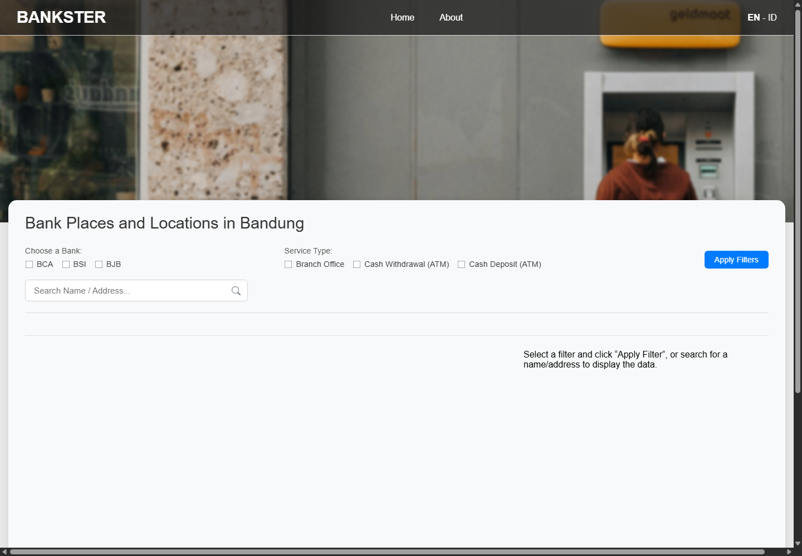
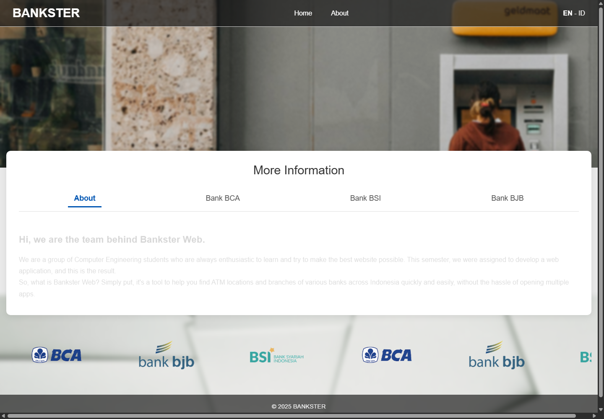
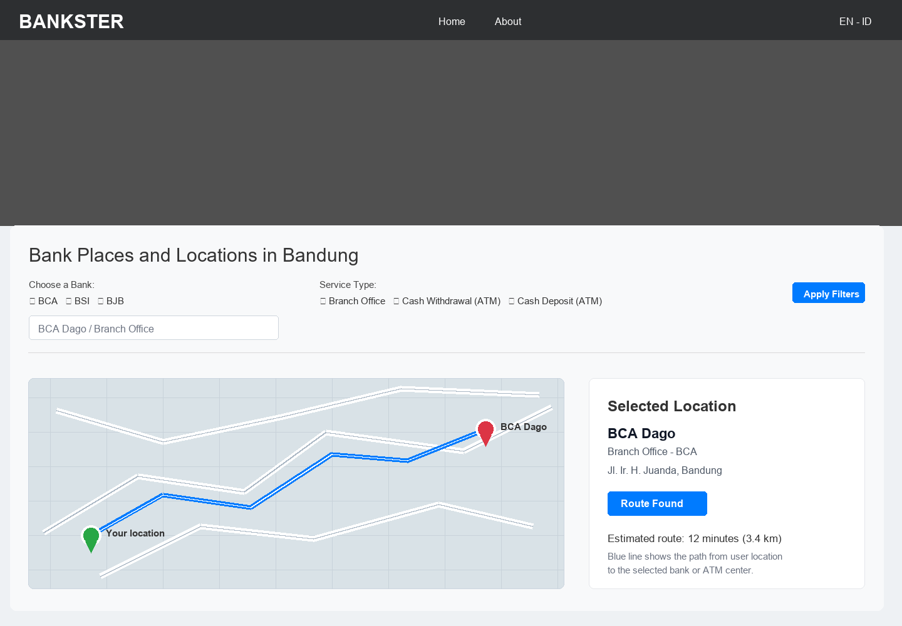

# Bankster

Bankster is a static web application for exploring bank branches and ATM service locations in Bandung. It provides an interactive map, location filtering, search, and route guidance to help users find nearby banking services more easily.

## Features

- Interactive Mapbox map
- Bank location markers for BCA, BSI, and BJB
- Filters by bank and service type
- Search by name or address
- Route guidance from the user's current location
- Bilingual pages in Indonesian and English
- About page with tabbed content

## UI Preview

Home page:



About page:



Route preview:



The preview screenshots use the static layout. Map and live location data require a local `Bankster/js/config.js` file with valid Supabase and Mapbox configuration.

## Tech Stack

- HTML
- CSS
- JavaScript
- Supabase
- Mapbox GL JS

## Local Configuration

This project uses local configuration for public frontend tokens. Copy the example file:

```text
Bankster/js/config.example.js
```

to:

```text
Bankster/js/config.js
```

Then fill in the Supabase URL, Supabase anon key, and Mapbox public token. The real `config.js` file is ignored by Git so tokens are not published to GitHub.

## Security Notes

- Restrict the Mapbox token by allowed URLs in the Mapbox dashboard.
- Keep Supabase Row Level Security enabled and configure table policies carefully.
- Do not commit `Bankster/js/config.js`, `.env`, or other local credential files.
